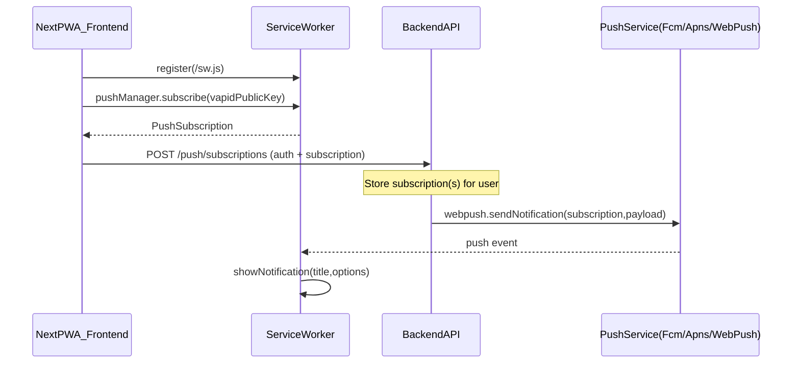

# Trigger web-push via API (separate backend)

## What you already have (so we’ll reuse it)

- **Client subscription flow**: `app/_hooks/usePushNotifications.tsx` registers `/sw.js` and calls `reg.pushManager.subscribe(...)`, but currently saves the subscription in **localStorage** (`"user-subscription"`).
- **Push receive UX**: `worker/index.ts` listens for the `push` event and calls `self.registration.showNotification(data.title, { body: data.body, icon: ... })`.
- **Server-side send (demo)**: `app/_actions/send-push-notification.ts` uses `web-push` + VAPID keys to send to a provided subscription.

## Target architecture

- **Backend (separate service)** owns:
  - VAPID private key
  - subscription storage (per user, multiple devices)
  - “trigger send” API
- **Next.js PWA frontend** owns:
  - requesting permission + creating PushSubscription
  - registering/updating that subscription with the backend for the current user

## Backend work (separate service)

### 1) Data model for per-user subscriptions

Store **multiple subscriptions per user** (one per browser/device), because users can install on phone + desktop.

- **Table/collection**: `push_subscriptions`
  - `id`
  - `user_id`
  - `endpoint` (unique)
  - `p256dh`, `auth` (from `subscription.keys`)
  - `expiration_time` (nullable)
  - `user_agent` (optional; helps debugging)
  - `created_at`, `updated_at`

### 2) VAPID keys + config

- Generate once: `npx web-push generate-vapid-keys` (public key can be shipped to clients; private key must stay backend-only).
- Backend env:
  - `VAPID_PUBLIC_KEY`
  - `VAPID_PRIVATE_KEY`
  - `VAPID_SUBJECT` (email or URL; your current template uses a URL)

### 3) Subscription management API (used by the PWA)

Implement endpoints (names can vary; these are common and simple):

- **GET** `/vapid-public-key`
  - returns `{ vapidPublicKey: "..." }`
- **POST** `/push/subscriptions`
  - **auth required** (derive `user_id` from token/session)
  - body includes the exact browser subscription JSON:
    - `{ subscription: PushSubscriptionJSON, userAgent?: string }`
  - backend upserts by `endpoint` (and ties it to the current user)
- **DELETE** `/push/subscriptions`
  - auth required
  - body `{ endpoint: string }` or path param `/push/subscriptions/:id`

### 4) Trigger-send API (per-user)

This is the “trigger notification using API” part.

- **POST** `/notifications/send`
  - auth required (or restricted to server-to-server)
  - body example:
    - `{ userId: "..." , title: "...", body: "...", url?: "...", tag?: "..." }`
  - backend:
    - loads all subscriptions for `userId`
    - loops and calls `webpush.sendNotification(sub, JSON.stringify(payload), { TTL, urgency })`
    - if send fails with **410/404**, remove that subscription (it’s expired/unsubscribed)

**Important security note:** for per-user targeting, don’t accept an arbitrary `userId` from an untrusted client unless the caller is allowed to send to that user.

- Typical patterns:
  - **User-self notifications**: ignore `userId` in body; use the authenticated user from token.
  - **Admin/system notifications**: require server-to-server auth (API key/JWT m2m) and allow specifying `userId`.

### 5) CORS + auth plumbing

Because this is a separate backend:

- Configure **CORS** to allow the Next.js origin.
- Decide auth transport:
  - `Authorization: Bearer <JWT>` (most common)
  - or cookie-based session (then CORS must allow credentials)

## Frontend work (Next.js PWA)

### 1) Stop using localStorage as the “source of truth”

In `app/_hooks/usePushNotifications.tsx`, right now you do:

- subscribe → `setUserSubscription(JSON.stringify(sub))`

Update the flow to:

- subscribe → **POST subscription to backend**
- keep local UI state (enabled/disabled) but treat backend as the canonical store.

### 2) Fetch VAPID public key from backend

Today `app/page.tsx` passes `process.env.VAPID_PUBLIC_KEY` into `NotificationManager`.

For a separate backend, either:

- fetch `GET /vapid-public-key` from backend on page load and pass into the hook, or
- keep the public key duplicated in Next env (still safe) as long as it matches backend’s VAPID keys.

### 3) Add unsubscribe support

Add a UI action to:

- call `reg.pushManager.getSubscription()` → `subscription.unsubscribe()`
- call backend `DELETE /push/subscriptions` to remove it

### 4) Improve push payload handling in the service worker

In `worker/index.ts`, you currently read `{ title, body }` and show a notification.

Enhance to support common fields:

- `data.url` and a `notificationclick` handler to open/focus your app
- optional `tag`, `badge`, `actions`

### 5) Update “Send Test Notification” button

`NotificationManager` currently calls the Next server action `sendPushNotification(...)` with the localStorage subscription.

For the new design, change it to call the backend trigger endpoint:

- `POST /notifications/send` (user-self or admin-only, depending on your auth model)

## Files you’ll touch in this repo

- [app/_hooks/usePushNotifications.tsx](app/_hooks/usePushNotifications.tsx): on subscribe/unsubscribe, call backend APIs instead of localStorage-only.
- [app/_components/notification-manager.tsx](app/_components/notification-manager.tsx): wire the new backend calls; adjust test-send.
- [worker/index.ts](worker/index.ts): optional click handler + richer payload fields.
- [app/page.tsx](app/page.tsx): source VAPID public key (from backend or env).

## Backend deliverables (outside this repo)

- **DB migration/model** for `push_subscriptions`
- **Routes**: `/vapid-public-key`, `/push/subscriptions`, `/notifications/send`
- **web-push integration** with VAPID keys + invalid-subscription cleanup
- **Auth + CORS** configuration

## Test plan

- Subscribe on an installed PWA → confirm backend stores subscription row(s).
- Trigger `/notifications/send` for the logged-in user → notification arrives.
- Unsubscribe → row deleted; triggering send no longer reaches that device.
- Expired subscription cleanup: simulate by deleting browser subscription and ensuring backend removes 410/404 endpoints.